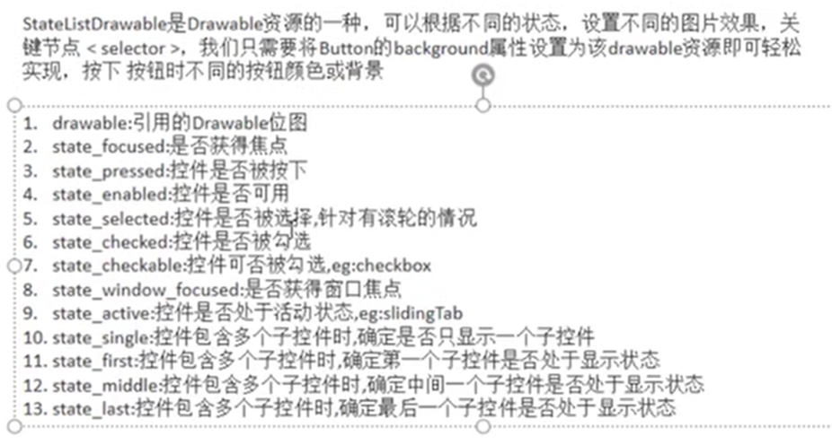

# 1.TextView

## 1.1基础属性详解


## 1.2带阴影的textview


## 1.3实现跑马灯效果的textview


### 1.3.1自动获取焦点

```java
package com.eninix.androidtest;

import android.content.Context;
import android.util.AttributeSet;
import android.widget.TextView;

import androidx.annotation.Nullable;

public class MyTextView extends TextView {

    public MyTextView(Context context) {
        super(context);
    }

    public MyTextView(Context context, @Nullable AttributeSet attrs) {
        super(context, attrs);
    }

    public MyTextView(Context context, @Nullable AttributeSet attrs, int defStyleAttr) {
        super(context, attrs, defStyleAttr);
    }

    @Override
    public boolean isFocused() {
        return true;
    }
}
```

```xml
<?xml version="1.0" encoding="utf-8"?>
<LinearLayout xmlns:android="http://schemas.android.com/apk/res/android"
    android:layout_width="match_parent"
    android:layout_height="match_parent"
    android:orientation="vertical">

    <com.eninix.androidtest.MyTextView
        android:id="@+id/tv_one"

        android:layout_width="match_parent"
        android:layout_height="200dp"
        android:background="@color/red"

        android:singleLine="true"
        android:ellipsize="marquee"
        android:marqueeRepeatLimit="marquee_forever"
        android:focusable="true"
        android:focusableInTouchMode="true"
        android:clickable="true"

        android:shadowColor="@color/teal_200"
        android:shadowDx="10"
        android:shadowDy="10"
        android:shadowRadius="10"

        android:gravity="center_vertical"
        android:text="@string/tv_one"
        android:textColor="@color/black"
        android:textSize="40sp"
        android:textStyle="italic" />

</LinearLayout>
```

或者

```xml
<?xml version="1.0" encoding="utf-8"?>
<LinearLayout xmlns:android="http://schemas.android.com/apk/res/android"
    android:layout_width="match_parent"
    android:layout_height="match_parent"
    android:orientation="vertical">

    <TextView
        android:id="@+id/tv_one"

        android:layout_width="match_parent"
        android:layout_height="200dp"
        android:background="@color/red"

        android:singleLine="true"
        android:ellipsize="marquee"
        android:marqueeRepeatLimit="marquee_forever"
        android:focusable="true"
        android:focusableInTouchMode="true"
        android:clickable="true"

        android:shadowColor="@color/teal_200"
        android:shadowDx="10"
        android:shadowDy="10"
        android:shadowRadius="10"

        android:gravity="center_vertical"
        android:text="@string/tv_one"
        android:textColor="@color/black"
        android:textSize="40sp"
        android:textStyle="italic" >

        <requestFocus/>
    </TextView>

</LinearLayout>
```

# 2.Button

## 2.1StateListDrawable



```xml
<?xml version="1.0" encoding="utf-8"?>
<LinearLayout xmlns:android="http://schemas.android.com/apk/res/android"
    android:layout_width="match_parent"
    android:layout_height="match_parent"
    android:orientation="vertical">

    <Button
        android:layout_width="200dp"
        android:layout_height="100dp"
        android:background="@drawable/btn_color_selector"
        android:textColor="@color/black"
        android:text="普通の釦">
    </Button>

</LinearLayout>
```

## 2.2Button事件处理

```java
package com.eninix.androidtest;

import androidx.appcompat.app.AppCompatActivity;

import android.os.Bundle;
import android.util.Log;
import android.view.MotionEvent;
import android.view.View;
import android.widget.Button;
import android.widget.TextView;

public class MainActivity extends AppCompatActivity {

    private static final String TAG = "eninix";

    @Override
    protected void onCreate(Bundle savedInstanceState) {
        super.onCreate(savedInstanceState);
        setContentView(R.layout.activity_main);

        TextView tv_one = findViewById(R.id.tv_one);
        // tv_one.setText("Hello World!");

        Button btn = findViewById(R.id.btn);

        // 点击事件
        btn.setOnClickListener(new View.OnClickListener() {
            @Override
            public void onClick(View v) {
                Log.e(TAG,"onClick");
            }
        });
        // 长按事件
        btn.setOnLongClickListener(new View.OnLongClickListener() {
            @Override
            public boolean onLongClick(View v) {
                Log.e(TAG,"onLongClick");
                return false; // 为true时,click不执行
            }
        });
        //触摸事件
        btn.setOnTouchListener(new View.OnTouchListener() {
            @Override
            public boolean onTouch(View v, MotionEvent event) {
                Log.e(TAG,"onTouch");
                return false; // 为true时,click和longclick不执行
            }
        });

    }
}
```

或者

```java
package com.eninix.androidtest;

import androidx.appcompat.app.AppCompatActivity;

import android.os.Bundle;
import android.util.Log;
import android.view.MotionEvent;
import android.view.View;
import android.widget.Button;
import android.widget.TextView;

public class MainActivity extends AppCompatActivity {

    private static final String TAG = "eninix";

    @Override
    protected void onCreate(Bundle savedInstanceState) {
        super.onCreate(savedInstanceState);
        setContentView(R.layout.activity_main);

    public void btnClick(View view) {
        
    }
}
    /*
       <Button
        android:id="@+id/btn"

        android:layout_width="200dp"
        android:layout_height="100dp"
        android:background="@drawable/btn_color_selector"

        android:onClick="btnClick" // 此处

        android:textColor="@color/black"
        android:text="普通の釦"/>
    */
```

