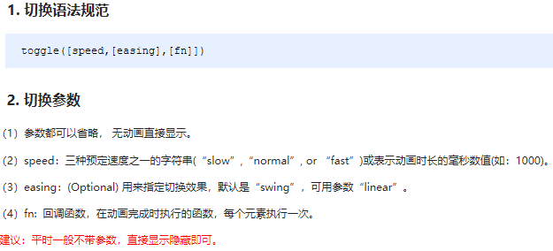
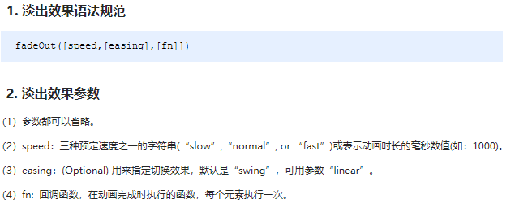
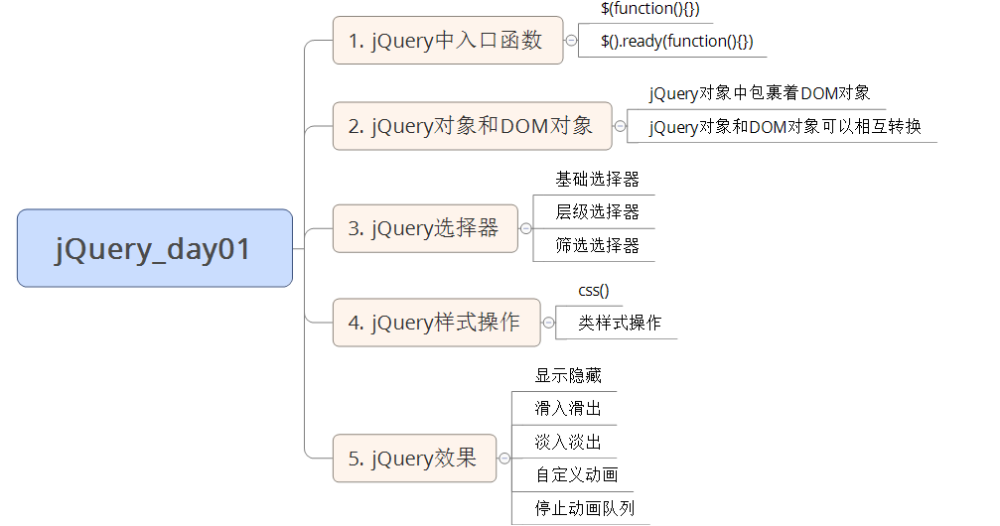
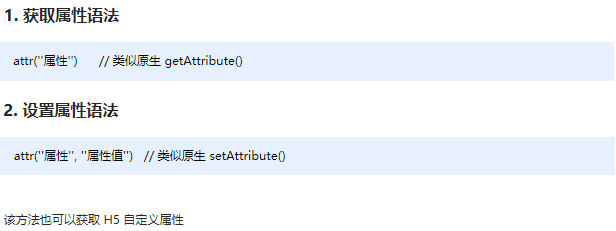

# day01 - jQuery

> 学习目标：
>
> 能够说出什么是 jQuery 
> 能够说出 jQuery 的优点
> 能够简单使用 jQuery
> 能够说出 DOM 对象和 jQuery 对象的区别
> 能够写出常用的 jQuery 选择器 
> 能够操作 jQuery 样式
> 能够写出常用的 jQuery 动画 


## 1.1. jQuery 介绍

### 1.1.1 JavaScript 库

​	JavaScript库：即 library，是一个封装好的特定的集合（方法和函数）。从封装一大堆函数的角度理解库，就是在这个库中，封装了很多预先定义好的函数在里面，比如动画animate、hide、show，比如获取元素等。

> 简单理解： 就是一个JS 文件，里面对我们原生js代码进行了封装，存放到里面。这样我们可以快速高效的使用这些封装好的功能了。
>
> 比如 jQuery，就是为了快速方便的操作DOM，里面基本都是函数（方法）。

​	常见的JavaScript 库：jQuery、Prototype、YUI、Dojo、Ext JS、移动端的zepto等，这些库都是对原生 JavaScript 的封装，内部都是用 JavaScript 实现的，我们主要学习的是 jQuery。

### 1.1.2 jQuery的概念

​	jQuery总体概况如下 :

- jQuery 是一个快速、简洁的 JavaScript 库，其设计的宗旨是“write Less，Do More”，即倡导写更少的代码，做更多的事情。

- j 就是 JavaScript；   Query 查询； 意思就是查询js，把js中的DOM操作做了封装，我们可以快速的查询使用里面的功能。

- jQuery 封装了 JavaScript 常用的功能代码，优化了 DOM 操作、事件处理、动画设计和 Ajax 交互。

- 学习jQuery本质： 就是学习调用这些函数（方法）。

- jQuery 出现的目的是加快前端人员的开发速度，我们可以非常方便的调用和使用它，从而提高开发效率。

  

### 1.1.3 jQuery的优点

1. 轻量级。核心文件才几十kb，不会影响页面加载速度。
2. 跨浏览器兼容，基本兼容了现在主流的浏览器。
3. 链式编程、隐式迭代。
4. 对事件、样式、动画支持，大大简化了DOM操作。
5. 支持插件扩展开发。有着丰富的第三方的插件，例如：树形菜单、日期控件、轮播图等。
6. 免费、开源。

## 1.2. jQuery 的基本使用

### 1.2.1 jQuery 的下载

​	jQuery的官网地址： https://jquery.com/，官网即可下载最新版本。

>  各个版本的下载：https://code.jquery.com/

​	版本介绍：

> 1x ：兼容 IE 678 等低版本浏览器， 官网不再更新
>
> 2x ：不兼容 IE 678 等低版本浏览器， 官网不再更新
>
> 3x ：不兼容 IE 678 等低版本浏览器， 是官方主要更新维护的版本

### 1.2.2. 体验jQuery

​	步骤：

- 引入jQuery文件。
- 在文档最末尾插入 script 标签，书写体验代码。
- $('div').hide() 可以隐藏盒子。

### 1.2.3. jQuery的入口函数

​	jQuery中常见的两种入口函数：

```javascript
// 第一种: 简单易用。
$(function () {   
    ...  // 此处是页面 DOM 加载完成的入口
}) ; 

// 第二种: 繁琐，但是也可以实现
$(document).ready(function(){
   ...  //  此处是页面DOM加载完成的入口
});
```

​	总结：

1. 等着 DOM 结构渲染完毕即可执行内部代码，不必等到所有外部资源加载完成，jQuery 帮我们完成了封装。
2. 相当于原生 js 中的 DOMContentLoaded。
3. 不同于原生 js 中的 load 事件是等页面文档、外部的 js 文件、css文件、图片加载完毕才执行内部代码。
4. 更推荐使用第一种方式。

### 1.2.4. jQuery中的顶级对象$

1.  \$是 jQuery 的别称，在代码中可以使用 jQuery 代替，但一般为了方便，通常都直接使用 $ 。
2.  \$是jQuery的顶级对象，相当于原生JavaScript中的 window。把元素利用$包装成jQuery对象，就可以调用jQuery 的方法。

### 1.2.5.  jQuery 对象和 DOM 对象

​	使用 jQuery 方法和原生JS获取的元素是不一样的，总结如下 : 

1. 用原生 JS 获取来的对象就是 DOM 对象
2. jQuery 方法获取的元素就是 jQuery 对象。
3. jQuery 对象本质是： 利用$对DOM 对象包装后产生的对象（伪数组形式存储）。

> 注意：
>
> 只有 jQuery 对象才能使用 jQuery 方法，DOM 对象则使用原生的 JavaScirpt 方法。


### 1.2.6.  jQuery 对象和 DOM 对象转换

​	DOM 对象与 jQuery 对象之间是可以相互转换的。因为原生js 比 jQuery 更大，原生的一些属性和方法 jQuery没有给我们封装. 要想使用这些属性和方法需要把jQuery对象转换为DOM对象才能使用。

```javascript
// 1.DOM对象转换成jQuery对象，方法只有一种
var box = document.getElementById('box');  // 获取DOM对象
var jQueryObject = $(box);  // 把DOM对象转换为 jQuery 对象

// 2.jQuery 对象转换为 DOM 对象有两种方法：
//   2.1 jQuery对象[索引值]
var domObject1 = $('div')[0]

//   2.2 jQuery对象.get(索引值)
var domObject2 = $('div').get(0)
 
```

总结：实际开发比较常用的是把DOM对象转换为jQuery对象，这样能够调用功能更加强大的jQuery中的方法。

## 1.3. jQuery 选择器

​	原生 JS 获取元素方式很多，很杂，而且兼容性情况不一致，因此 jQuery 给我们做了封装，使获取元素统一标准。

### 1.3.1. 基础选择器

```js
$("选择器")   //  里面选择器直接写 CSS 选择器即可，但是要加引号 
```

​	

### 1.3.2. 层级选择器

​	层级选择器最常用的两个分别为：后代选择器和子代选择器。

​	

**基础选择器和层级选择器案例代码**

```javascript
<body>
    <div>我是div</div>
    <div class="nav">我是nav div</div>
    <p>我是p</p>
    <ul>
        <li>我是ul 的</li>
        <li>我是ul 的</li>        
        <li>我是ul 的</li>
    </ul>
    <script>
        $(function() {
            console.log($(".nav"));
            console.log($("ul li"));
        })
    </script>
</body>
```

### 1.3.3. 筛选选择器

​	筛选选择器，顾名思义就是在所有的选项中选择满足条件的进行筛选选择。常见如下 :


**案例代码**

```js
<body>
    <ul>
        <li>多个里面筛选几个</li>
        <li>多个里面筛选几个</li>
        <li>多个里面筛选几个</li>
        <li>多个里面筛选几个</li>
        <li>多个里面筛选几个</li>
        <li>多个里面筛选几个</li>
    </ul>
    <ol>
        <li>多个里面筛选几个</li>
        <li>多个里面筛选几个</li>
        <li>多个里面筛选几个</li>
        <li>多个里面筛选几个</li>
        <li>多个里面筛选几个</li>
        <li>多个里面筛选几个</li>
    </ol>
    <script>
        $(function() {
            $("ul li:first").css("color", "red");
            $("ul li:eq(2)").css("color", "blue");
            $("ol li:odd").css("color", "skyblue");
            $("ol li:even").css("color", "pink");
        })
    </script>
</body>
```

另:  jQuery中还有一些筛选方法，类似DOM中的通过一个节点找另外一个节点，父、子、兄以外有所加强。


偏重于记忆，演示代码略。

### 1.3.4 知识铺垫

- jQuery 设置样式

```javascript
$('div').css('属性', '值')    
```

- jQuery 里面的排他思想

```javascript
// 想要多选一的效果，排他思想：当前元素设置样式，其余的兄弟元素清除样式。
$(this).css(“color”,”red”);
$(this).siblings(). css(“color”,””);
```

- 隐式迭代

```javascript
// 遍历内部 DOM 元素（伪数组形式存储）的过程就叫做隐式迭代。
// 简单理解：给匹配到的所有元素进行循环遍历，执行相应的方法，而不用我们再进行循环，简化我们的操作，方便我们调用。
$('div').hide();  // 页面中所有的div全部隐藏，不用循环操作
```

- 链式编程

```javascript
// 链式编程是为了节省代码量，看起来更优雅。
$(this).css('color', 'red').sibling().css('color', ''); 
```

### 1.3.5 案例：淘宝服饰精品案例
> 思路分析: 
> 1.核心原理：鼠标经过左侧盒子某个小li，就让内容区盒子相对应图片显示，其余的图片隐藏。
> 2.需要得到当前小li 的索引号，就可以显示对应索引号的图片
> 3.jQuery 得到当前元素索引号 $(this).index()
> 4.中间对应的图片，可以通过  eq(index) 方法去选择
> 5.显示元素 show()   隐藏元素 hide()

​	代码实现略。(详情参考源代码)

## 1.4.  jQuery 样式操作

​	jQuery中常用的样式操作有两种：css() 和 设置类样式方法

### 1.4.1. 方法1: 操作 css 方法

​	jQuery 可以使用 css 方法来修改简单元素样式； 也可以操作类，修改多个样式。

​	常用以下三种形式 : 

```javascript
// 1.参数只写属性名，则是返回属性值
var strColor = $(this).css('color');

// 2.  参数是属性名，属性值，逗号分隔，是设置一组样式，属性必须加引号，值如果是数字可以不用跟单位和引号
$(this).css(''color'', ''red'');

// 3.  参数可以是对象形式，方便设置多组样式。属性名和属性值用冒号隔开， 属性可以不用加引号
$(this).css({ "color":"white","font-size":"20px"});

```

​	注意：css() 多用于样式少时操作，多了则不太方便。

### 1.4.2. 方法2: 设置类样式方法

​	作用等同于以前的 classList，可以操作类样式， 注意操作类里面的参数不要加点。

​	常用的三种设置类样式方法：

```javascript
// 1.添加类
$("div").addClass("current");

// 2.删除类
$("div").removeClass("current");

// 3.切换类
$("div").toggleClass("current");

```

​	注意：

1. 设置类样式方法比较适合样式多时操作，可以弥补css()的不足。
2. 原生 JS 中 className 会覆盖元素原先里面的类名，jQuery 里面类操作只是对指定类进行操作，不影响原先的类名。

### 1.4.3. 案例：tab 栏切换

> 思路分析: 
> 1.点击上部的li，当前li 添加current类，其余兄弟移除类。
> 2.点击的同时，得到当前li 的索引号
> 3.让下部里面相应索引号的item显示，其余的item隐藏

​	代码实现略。(详情参考源代码)

## 1.5. jQuery 效果

​	jQuery 给我们封装了很多动画效果，最为常见的如下：

- 显示隐藏：show() / hide() / toggle() ;
- 划入画出：slideDown() / slideUp() / slideToggle() ; 
- 淡入淡出：fadeIn() / fadeOut() / fadeToggle() / fadeTo() ; 
- 自定义动画：animate() ;

> 注意：
>
> 动画或者效果一旦触发就会执行，如果多次触发，就造成多个动画或者效果排队执行。
>
> jQuery为我们提供另一个方法，可以停止动画排队：stop() ;

### 1.5.1. 显示隐藏

​	显示隐藏动画，常见有三个方法：show() / hide() / toggle() ;

​	语法规范如下:




**代码演示**

```javascript
<body>
    <button>显示</button>
    <button>隐藏</button>
    <button>切换</button>
    <div></div>
    <script>
        $(function() {
            $("button").eq(0).click(function() {
                $("div").show(1000, function() {
                    alert(1);
                });
            })
            $("button").eq(1).click(function() {
                $("div").hide(1000, function() {
                    alert(1);
                });
            })
            $("button").eq(2).click(function() {
              $("div").toggle(1000);
            })
            // 一般情况下，我们都不加参数直接显示隐藏就可以了
        });
    </script>
</body>
```

### 1.5.2. 滑入滑出

​	滑入滑出动画，常见有三个方法：slideDown() / slideUp() / slideToggle() ; 

​	语法规范如下:


**代码演示**

```javascript
<body>
    <button>下拉滑动</button>
    <button>上拉滑动</button>
    <button>切换滑动</button>
    <div></div>
    <script>
        $(function() {
            $("button").eq(0).click(function() {
                // 下滑动 slideDown()
                $("div").slideDown();
            })
            $("button").eq(1).click(function() {
                // 上滑动 slideUp()
                $("div").slideUp(500);
            })
            $("button").eq(2).click(function() {
                // 滑动切换 slideToggle()
                $("div").slideToggle(500);
            });
        });
    </script>
</body>
```

> 小案例：下拉菜单略（详情参看源码）。

### 1.5.3 淡入淡出

​	淡入淡出动画，常见有四个方法：fadeIn() / fadeOut() / fadeToggle() / fadeTo() ; 

​	语法规范如下:





**代码演示**

```javascript
<body>
    <button>淡入效果</button>
    <button>淡出效果</button>
    <button>淡入淡出切换</button>
    <button>修改透明度</button>
    <div></div>
    <script>
        $(function() {
            $("button").eq(0).click(function() {
                // 淡入 fadeIn()
                $("div").fadeIn(1000);
            })
            $("button").eq(1).click(function() {
                // 淡出 fadeOut()
                $("div").fadeOut(1000);
            })
            $("button").eq(2).click(function() {
                // 淡入淡出切换 fadeToggle()
                $("div").fadeToggle(1000);
            });
            $("button").eq(3).click(function() {
                //  修改透明度 fadeTo() 这个速度和透明度要必须写
                $("div").fadeTo(1000, 0.5);
            });
        });
    </script>
</body>
```

### 1.5.4 自定义动画

​	自定义动画非常强大，通过参数的传递可以模拟以上所有动画，方法为：animate() ;

​	语法规范如下:


**代码演示**

```javascript
<body>
    <button>动起来</button>
    <div></div>
    <script>
        $(function() {
            $("button").click(function() {
                $("div").animate({
                    left: 500,
                    top: 300,
                    opacity: .4,
                    width: 500
                }, 500);
            })
        })
    </script>
</body>
```

### 1.5.5 停止动画排队

​	动画或者效果一旦触发就会执行，如果多次触发，就造成多个动画或者效果排队执行。

​	停止动画排队的方法为：stop() ; 

- stop() 方法用于停止动画或效果。
- stop() 写到动画或者效果的前面， 相当于停止结束上一次的动画。

​        总结: 每次使用动画之前，先调用 stop() ,在调用动画。

### 1.5.6. 事件切换

​	jQuery中为我们添加了一个新事件 hover() ; 功能类似 css 中的伪类 :hover 。介绍如下

**语法**

```javascript
hover([over,]out)     // 其中over和out为两个函数
```

- over:鼠标移到元素上要触发的函数（相当于mouseenter）
- out:鼠标移出元素要触发的函数（相当于mouseleave）
- 如果只写一个函数，则鼠标经过和离开都会触发它

**hover事件和停止动画排列案例**

```javascript
<body>
    <ul class="nav">
        <li>
            <a href="#">微博</a>
            <ul><li><a href="">私信</a></li><li><a href="">评论</a></li><li><a href="">@我</a></li></ul>
        </li>
        <li>
            <a href="#">微博</a>
            <ul><li><a href="">私信</a></li><li><a href="">评论</a></li><li><a href="">@我</a></li></ul>
        </li>
    </ul>
    <script>
        $(function() {
            // 鼠标经过
            // $(".nav>li").mouseover(function() {
            //     // $(this) jQuery 当前元素  this不要加引号
            //     // show() 显示元素  hide() 隐藏元素
            //     $(this).children("ul").slideDown(200);
            // });
            // // 鼠标离开
            // $(".nav>li").mouseout(function() {
            //     $(this).children("ul").slideUp(200);
            // });
            // 1. 事件切换 hover 就是鼠标经过和离开的复合写法
            // $(".nav>li").hover(function() {
            //     $(this).children("ul").slideDown(200);
            // }, function() {
            //     $(this).children("ul").slideUp(200);
            // });
            // 2. 事件切换 hover  如果只写一个函数，那么鼠标经过和鼠标离开都会触发这个函数
            $(".nav>li").hover(function() {
                // stop 方法必须写到动画的前面
                $(this).children("ul").stop().slideToggle();
            });
        })
    </script>
</body>
```

### 1.5.7. 案例：王者荣耀手风琴效果

> 思路分析: 
> 1.鼠标经过某个小li 有两步操作：
> 2.当前小li 宽度变为 224px， 同时里面的小图片淡出，大图片淡入
> 3.其余兄弟小li宽度变为69px， 小图片淡入， 大图片淡出

​	代码实现略。(详情参考源代码)

## 1.6. 今日总结




# day02 - jQuery

> 学习目标：
>
> 能够操作  jQuery 属性 
> 能够操作  jQuery 元素
> 能够操作  jQuery 元素尺寸、位置

## 1.1. jQuery 属性操作

​	jQuery 常用属性操作有三种：prop() / attr() / data() ;

### 1.1.1 元素固有属性值 prop()

​	所谓元素固有属性就是元素本身自带的属性，比如 <a> 元素里面的 href ，比如 <input> 元素里面的 type。 

**语法**


​	注意：prop() 除了普通属性操作，更适合操作表单属性：disabled / checked / selected 等。

### 1.1.2 元素自定义属性值 attr()

​	用户自己给元素添加的属性，我们称为自定义属性。 比如给 div 添加 index =“1”。 

**语法**



​	注意：attr() 除了普通属性操作，更适合操作自定义属性。（该方法也可以获取 H5 自定义属性）

### 1.1.3 数据缓存 data()

​	data() 方法可以在指定的元素上存取数据，并不会修改 DOM 元素结构。一旦页面刷新，之前存放的数据都将被移除。 

**语法**


​	注意：同时，还可以读取 HTML5 自定义属性  data-index ，得到的是数字型。

**演示代码**

```javascript
<body>
    <a href="http://www.itcast.cn" title="都挺好">都挺好</a>
    <input type="checkbox" name="" id="" checked>
    <div index="1" data-index="2">我是div</div>
    <span>123</span>
    <script>
        $(function() {
            //1. element.prop("属性名") 获取元素固有的属性值
            console.log($("a").prop("href"));
            $("a").prop("title", "我们都挺好");
            $("input").change(function() {
                console.log($(this).prop("checked"));
            });
            // console.log($("div").prop("index"));
            // 2. 元素的自定义属性 我们通过 attr()
            console.log($("div").attr("index"));
            $("div").attr("index", 4);
            console.log($("div").attr("data-index"));
            // 3. 数据缓存 data() 这个里面的数据是存放在元素的内存里面
            $("span").data("uname", "andy");
            console.log($("span").data("uname"));
            // 这个方法获取data-index h5自定义属性 第一个 不用写data-  而且返回的是数字型
            console.log($("div").data("index"));
        })
    </script>
</body>
```

### 1.1.4 案例：购物车案例模块-全选

> 1.全选思路：里面3个小的复选框按钮（j-checkbox）选中状态（checked）跟着全选按钮（checkall）走。
> 2.因为checked 是复选框的固有属性，此时我们需要利用prop()方法获取和设置该属性。
> 3.把全选按钮状态赋值给3小复选框就可以了。
> 4.当我们每次点击小的复选框按钮，就来判断：
> 5.如果小复选框被选中的个数等于3 就应该把全选按钮选上，否则全选按钮不选。
> 6.:checked 选择器      :checked 查找被选中的表单元素。

​	代码实现略。(详情参考源代码)

## 1.2. jQuery 文本属性值

​	jQuery的文本属性值常见操作有三种：html() / text() / val() ; 分别对应JS中的 innerHTML 、innerText 和 value 属性。

### 1.2.1 jQuery内容文本值

​	常见操作有三种：html() / text() / val() ; 分别对应JS中的 innerHTML 、innerText 和 value 属性，主要针对元素的内容还有表单的值操作。

**语法**


​	注意：html() 可识别标签，text() 不识别标签。

**演示代码**

```javascript
<body>
    <div>
        <span>我是内容</span>
    </div>
    <input type="text" value="请输入内容">
    <script>
        // 1. 获取设置元素内容 html()
        console.log($("div").html());
        // $("div").html("123");
        // 2. 获取设置元素文本内容 text()
        console.log($("div").text());
        $("div").text("123");
        // 3. 获取设置表单值 val()
        console.log($("input").val());
        $("input").val("123");
    </script>
</body>
```

### 1.2.2. 案例：购物车案例模块-增减商品数量

> 1.核心思路：首先声明一个变量，当我们点击+号（increment），就让这个值++，然后赋值给文本框。
> 2.注意1： 只能增加本商品的数量， 就是当前+号的兄弟文本框（itxt）的值。 
> 3.修改表单的值是val() 方法
> 4.注意2： 这个变量初始值应该是这个文本框的值，在这个值的基础上++。要获取表单的值
> 5.减号（decrement）思路同理，但是如果文本框的值是1，就不能再减了。

​	代码实现略。(详情参考源代码)

### 1.2.3. 案例：购物车案例模块-修改商品小计

> 1.核心思路：每次点击+号或者-号，根据文本框的值 乘以 当前商品的价格  就是 商品的小计
> 2.注意1： 只能增加本商品的小计， 就是当前商品的小计模块（p-sum）  
> 3.修改普通元素的内容是text() 方法
> 4.注意2： 当前商品的价格，要把￥符号去掉再相乘 截取字符串 substr(1)
> 5.parents(‘选择器’) 可以返回指定祖先元素  
> 6.最后计算的结果如果想要保留2位小数 通过 toFixed(2)  方法
> 7.用户也可以直接修改表单里面的值，同样要计算小计。 用表单change事件
> 8.用最新的表单内的值 乘以 单价即可  但是还是当前商品小计

​	代码实现略。(详情参考源代码)

## 1.3. jQuery 元素操作

​	jQuery 元素操作主要讲的是用jQuery方法，操作标签的遍历、创建、添加、删除等操作。

### 1.3.1. 遍历元素

​	jQuery 隐式迭代是对同一类元素做了同样的操作。 如果想要给同一类元素做不同操作，就需要用到遍历。

**语法1**


​	注意：此方法用于遍历 jQuery 对象中的每一项，回调函数中元素为 DOM 对象，想要使用 jQuery 方法需要转换。

**语法2**


​	注意：此方法用于遍历 jQuery 对象中的每一项，回调函数中元素为 DOM 对象，想要使用 jQuery 方法需要转换。

**演示代码**

```javascript
<body>
    <div>1</div>
    <div>2</div>
    <div>3</div>
    <script>
        $(function() {
            // 如果针对于同一类元素做不同操作，需要用到遍历元素（类似for，但是比for强大）
            var sum = 0;
            var arr = ["red", "green", "blue"];
            // 1. each() 方法遍历元素 
            $("div").each(function(i, domEle) {
                // 回调函数第一个参数一定是索引号  可以自己指定索引号号名称
                // console.log(i);
                // 回调函数第二个参数一定是 dom 元素对象，也是自己命名
                // console.log(domEle);  // 使用jQuery方法需要转换 $(domEle)
                $(domEle).css("color", arr[i]);
                sum += parseInt($(domEle).text());
            })
            console.log(sum);
            // 2. $.each() 方法遍历元素 主要用于遍历数据，处理数据
            // $.each($("div"), function(i, ele) {
            //     console.log(i);
            //     console.log(ele);
            // });
            // $.each(arr, function(i, ele) {
            //     console.log(i);
            //     console.log(ele);
            // })
            $.each({
                name: "andy",
                age: 18
            }, function(i, ele) {
                console.log(i); // 输出的是 name age 属性名
                console.log(ele); // 输出的是 andy  18 属性值
            })
        })
    </script>
</body>
```

### 1.3.2. 案例：购物车案例模块-计算总计和总额

> 1.把所有文本框中的值相加就是总额数量，总计同理。
> 2.文本框里面的值不同，如果想要相加需要用 each() 遍历，声明一个变量做计数器，累加即可。

​	代码实现略。(详情参考源代码)

### 1.3.3. 创建、添加、删除

​	jQuery方法操作元素的创建、添加、删除方法很多，则重点使用部分，如下：

**语法总和**


​	注意：以上只是元素的创建、添加、删除方法的常用方法，其他方法请参详API。

**案例代码**

```js
<body>
    <ul>
        <li>原先的li</li>
    </ul>
    <div class="test">我是原先的div</div>
    <script>
        $(function() {
            // 1. 创建元素
            var li = $("<li>我是后来创建的li</li>");
      
            // 2. 添加元素
            // 	2.1 内部添加
            // $("ul").append(li);  内部添加并且放到内容的最后面 
            $("ul").prepend(li); // 内部添加并且放到内容的最前面
            //  2.2 外部添加
            var div = $("<div>我是后妈生的</div>");
            // $(".test").after(div);
            $(".test").before(div);
      
            // 3. 删除元素
            // $("ul").remove(); 可以删除匹配的元素 自杀
            // $("ul").empty(); // 可以删除匹配的元素里面的子节点 孩子
            $("ul").html(""); // 可以删除匹配的元素里面的子节点 孩子
        })
    </script>
</body>
```

### 1.3.4 案例：购物车案例模块-删除商品模块

> 1.核心思路：把商品remove() 删除元素即可
> 2.有三个地方需要删除： 1. 商品后面的删除按钮 2. 删除选中的商品 3. 清理购物车
> 3.商品后面的删除按钮： 一定是删除当前的商品，所以从 $(this) 出发
> 4.删除选中的商品： 先判断小的复选框按钮是否选中状态，如果是选中，则删除对应的商品
> 5.清理购物车： 则是把所有的商品全部删掉

​	代码实现略。(详情参考源代码)

### 1.3.5 案例：购物车案例模块-选中商品添加背景

> 1.核心思路：选中的商品添加背景，不选中移除背景即可
> 2.全选按钮点击：如果全选是选中的，则所有的商品添加背景，否则移除背景
> 3.小的复选框点击： 如果是选中状态，则当前商品添加背景，否则移除背景
> 4.这个背景，可以通过类名修改，添加类和删除类

​	代码实现略。(详情参考源代码)

## 1.4.  jQuery 尺寸、位置操作

​	jQuery中分别为我们提供了两套快速获取和设置元素尺寸和位置的API，方便易用，内容如下。

### 1.4.1.  jQuery 尺寸操作

​	 jQuery 尺寸操作包括元素宽高的获取和设置，且不一样的API对应不一样的盒子模型。

**语法**


**代码演示**

```javascript
<body>
    <div></div>
    <script>
        $(function() {
            // 1. width() / height() 获取设置元素 width和height大小 
            console.log($("div").width());
            // $("div").width(300);

            // 2. innerWidth() / innerHeight()  获取设置元素 width和height + padding 大小 
            console.log($("div").innerWidth());

            // 3. outerWidth()  / outerHeight()  获取设置元素 width和height + padding + border 大小 
            console.log($("div").outerWidth());

            // 4. outerWidth(true) / outerHeight(true) 获取设置 width和height + padding + border + margin
            console.log($("div").outerWidth(true));
        })
    </script>
</body>
```

​	注意：有了这套 API 我们将可以快速获取和子的宽高，至于其他属性想要获取和设置，还要使用 css() 等方法配合。

### 1.4.2. jQuery 位置操作

​	jQuery的位置操作主要有三个： offset()、position()、scrollTop()/scrollLeft() , 具体介绍如下: 

**语法**


**代码演示**

```javascript
<body>
    <div class="father">
        <div class="son"></div>
    </div>
        
    <div class="back">返回顶部</div>
    <div class="container"></div>
   
    <script>
        $(function() {
            // 1. 获取设置距离文档的位置（偏移） offset
            console.log($(".son").offset());
            console.log($(".son").offset().top);
            // $(".son").offset({
            //     top: 200,
            //     left: 200
            // });
      
            // 2. 获取距离带有定位父级位置（偏移） position   如果没有带有定位的父级，则以文档为准
            // 这个方法只能获取不能设置偏移
            console.log($(".son").position());
            // $(".son").position({
            //     top: 200,
            //     left: 200
            // });
      
      		// 3. 被卷去的头部
      		$(document).scrollTop(100);
            // 被卷去的头部 scrollTop()  / 被卷去的左侧 scrollLeft()
            // 页面滚动事件
            var boxTop = $(".container").offset().top;
            $(window).scroll(function() {
                // console.log(11);
                console.log($(document).scrollTop());
                if ($(document).scrollTop() >= boxTop) {
                    $(".back").fadeIn();
                } else {
                    $(".back").fadeOut();
                }
            });
            // 返回顶部
            $(".back").click(function() {
                // $(document).scrollTop(0);
                $("body, html").stop().animate({
                    scrollTop: 0
                });
                // $(document).stop().animate({
                //     scrollTop: 0
                // }); 不能是文档而是 html和body元素做动画
            })
        })
    </script>
</body>
```

### 1.4.3. 案例：带有动画的返回顶部

> 1.核心原理： 使用animate动画返回顶部。
> 2.animate动画函数里面有个scrollTop 属性，可以设置位置
> 3.但是是元素做动画，因此 $(“body,html”).animate({scrollTop: 0})

​	代码实现略。(详情参考源代码)

### 1.4.4. 案例： 品优购电梯导航（上）

> 1.当我们滚动到 今日推荐 模块，就让电梯导航显示出来
> 2.点击电梯导航页面可以滚动到相应内容区域
> 3.核心算法：因为电梯导航模块和内容区模块一一对应的
> 4.当我们点击电梯导航某个小模块，就可以拿到当前小模块的索引号
> 5.就可以把animate要移动的距离求出来：当前索引号内容区模块它的offset().top
> 6.然后执行动画即可

​	代码实现略。(详情参考源代码)

### 1.4.5. 案例：品优购电梯导航（下）

> 1.当我们点击电梯导航某个小li， 当前小li 添加current类，兄弟移除类名
> 2.当我们页面滚动到内容区域某个模块， 左侧电梯导航，相对应的小li模块，也会添加current类， 兄弟移除current类。
> 3.触发的事件是页面滚动，因此这个功能要写到页面滚动事件里面。
> 4.需要用到each，遍历内容区域大模块。 each里面能拿到内容区域每一个模块元素和索引号
> 5.判断的条件：  被卷去的头部 大于等于 内容区域里面每个模块的offset().top
> 6.就利用这个索引号找到相应的电梯导航小li添加类。


​	代码实现略。(详情参考源代码)

## 1.5. 今日总结


# day03 - jQuery

> 学习目标：
>
> 能够说出4种常见的注册事件 
> 能够说出 on 绑定事件的优势
> 能够说出 jQuery 事件委派的优点以及方式
> 能够说出绑定事件与解绑事件
> 能够说出 jQuery 对象的拷贝方法
> 能够说出 jQuery 多库共存的2种方法
> 能够使用 jQuery 插件

## 1.1. jQuery 事件注册

​	jQuery 为我们提供了方便的事件注册机制，是开发人员抑郁操作优缺点如下：

- 优点: 操作简单，且不用担心事件覆盖等问题。
- 缺点: 普通的事件注册不能做事件委托，且无法实现事件解绑，需要借助其他方法。

**语法**


**演示代码**

```javascript
<body>
    <div></div>
    <script>
        $(function() {
            // 1. 单个事件注册
            $("div").click(function() {
                $(this).css("background", "purple");
            });
            $("div").mouseenter(function() {
                $(this).css("background", "skyblue");
            });
        })
    </script>
</body>
```

## 1.2. jQuery 事件处理

​	因为普通注册事件方法的不足，jQuery又开发了多个处理方法，重点讲解如下：

- on(): 用于事件绑定，目前最好用的事件绑定方法
- off(): 事件解绑
- trigger() / triggerHandler(): 事件触发

### 1.2.1 事件处理 on() 绑定事件

​	因为普通注册事件方法的不足，jQuery又创建了多个新的事件绑定方法bind() / live() / delegate() / on()等，其中最好用的是: on()

**语法**


**演示代码**

```javascript
<body>
    <div></div>
    <ul>
        <li>我们都是好孩子</li>
        <li>我们都是好孩子</li>
        <li>我们都是好孩子</li>
    </ul>
    <ol></ol>

    <script>
        $(function() {
            // (1) on可以绑定1个或者多个事件处理程序
            // $("div").on({
            //     mouseenter: function() {
            //         $(this).css("background", "skyblue");
            //     },
            //     click: function() {
            //         $(this).css("background", "purple");
            //     }
            // });
            $("div").on("mouseenter mouseleave", function() {
                $(this).toggleClass("current");
            });
  
            // (2) on可以实现事件委托（委派）
            // click 是绑定在ul 身上的，但是 触发的对象是 ul 里面的小li
            // $("ul li").click();
            $("ul").on("click", "li", function() {
                alert(11);
            });

            // (3) on可以给未来动态创建的元素绑定事件
            $("ol").on("click", "li", function() {
                alert(11);
            })
            var li = $("<li>我是后来创建的</li>");
            $("ol").append(li);
        })
    </script>
</body>

```

### 1.2.2. 案例：发布微博案例

> 1.点击发布按钮， 动态创建一个小li，放入文本框的内容和删除按钮， 并且添加到ul 中。
> 2.点击的删除按钮，可以删除当前的微博留言。

​	代码实现略。(详情参考源代码)

### 1.2.3. 事件处理 off() 解绑事件

​	当某个事件上面的逻辑，在特定需求下不需要的时候，可以把该事件上的逻辑移除，这个过程我们称为事件解绑。jQuery 为我们提供 了多种事件解绑方法：die() / undelegate() / off() 等，甚至还有只触发一次的事件绑定方法 one()，在这里我们重点讲解一下 off() ;

**语法**


**演示代码**

```javascript
<body>
    <div></div>
    <ul>
        <li>我们都是好孩子</li>
        <li>我们都是好孩子</li>
        <li>我们都是好孩子</li>
    </ul>
    <p>我是一个P标签</p>
	<script>
        $(function() {
  			// 事件绑定
            $("div").on({
                click: function() {
                    console.log("我点击了");
                },
                mouseover: function() {
                    console.log('我鼠标经过了');
                }
            });
            $("ul").on("click", "li", function() {
                alert(11);
            });
  
            // 1. 事件解绑 off 
            // $("div").off();  // 这个是解除了div身上的所有事件
            $("div").off("click"); // 这个是解除了div身上的点击事件
            $("ul").off("click", "li");
  
            // 2. one() 但是它只能触发事件一次
            $("p").one("click", function() {
                alert(11);
            })
        })
    </script>
</body>
```

### 1.2.4. 事件处理 trigger() 自动触发事件

​	有些时候，在某些特定的条件下，我们希望某些事件能够自动触发, 比如轮播图自动播放功能跟点击右侧按钮一致。可以利用定时器自动触发右侧按钮点击事件，不必鼠标点击触发。由此 jQuery 为我们提供了两个自动触发事件 trigger() 和 triggerHandler() ; 

**语法**


**演示代码**

```javascript
<body>
    <div></div>
    <input type="text">
      
    <script>
    $(function() {
      // 绑定事件
      $("div").on("click", function() {
        alert(11);
      });

      // 自动触发事件
      // 1. 元素.事件()
      // $("div").click();会触发元素的默认行为
      
      // 2. 元素.trigger("事件")
      // $("div").trigger("click");会触发元素的默认行为
      $("input").trigger("focus");
      
      // 3. 元素.triggerHandler("事件") 就是不会触发元素的默认行为
      $("input").on("focus", function() {
        $(this).val("你好吗");
      });
      // 一个会获取焦点，一个不会
      $("div").triggerHandler("click");
      // $("input").triggerHandler("focus");
    });
    </script>
</body>
```

## 1.3. jQuery 事件对象

​	jQuery 对DOM中的事件对象 event 进行了封装，兼容性更好，获取更方便，使用变化不大。事件被触发，就会有事件对象的产生。

**语法**


**演示代码**

```javascript
<body>
    <div></div>

	<script>
        $(function() {
            $(document).on("click", function() {
                console.log("点击了document");
            })
            $("div").on("click", function(event) {
                // console.log(event);
                console.log("点击了div");
                event.stopPropagation();
            })
        })
    </script>
</body>
```

注意：jQuery中的 event 对象使用，可以借鉴 API 和 DOM 中的 event 。

## 1.4.  jQuery 拷贝对象

​	jQuery中分别为我们提供了两套快速获取和设置元素尺寸和位置的API，方便易用，内容如下。

**语法**


**演示代码**

```javascript
 <script>
        $(function() {
   			// 1.合并数据
            var targetObj = {};
            var obj = {
                id: 1,
                name: "andy"
            };
            // $.extend(target, obj);
            $.extend(targetObj, obj);
            console.log(targetObj);
   
   			// 2. 会覆盖 targetObj 里面原来的数据
            var targetObj = {
                id: 0
            };
            var obj = {
                id: 1,
                name: "andy"
            };
            // $.extend(target, obj);
            $.extend(targetObj, obj);
            console.log(targetObj); 
        })
    </script>
```

## 1.5.  jQuery 多库共存

​	实际开发中，很多项目连续开发十多年，jQuery版本不断更新，最初的 jQuery 版本无法满足需求，这时就需要保证在旧有版本正常运行的情况下，新的功能使用新的jQuery版本实现，这种情况被称为，jQuery 多库共存。

**语法**


**演示代码**

```javascript
<script>
	$(function() {
  		// 让jquery 释放对$ 控制权 让用自己决定
  		var suibian = jQuery.noConflict();
  		console.log(suibian("span"));
	})
</script>
```

## 1.6.  jQuery 插件

​	jQuery 功能比较有限，想要更复杂的特效效果，可以借助于 jQuery 插件完成。 这些插件也是依赖于jQuery来完成的，所以必须要先引入

jQuery文件，因此也称为 jQuery 插件。

​	jQuery 插件常用的网站：

1. jQuery 插件库  http://www.jq22.com/     

2. jQuery 之家   http://www.htmleaf.com/ 

	jQuery 插件使用步骤：

3. 引入相关文件。（jQuery 文件 和 插件文件）    

4. 复制相关html、css、js (调用插件)。

### 1.4.1.  瀑布流插件（重点讲解）

​	我们学习的第一个插件是jQuery之家的开源插件，瀑布流。我们将重点详细讲解，从找到插件所在网页，然后点击下载代码，到插件的使用等，后面的插件使用可参考瀑布流插件的使用。

**下载位置**


**代码演示**

​	插件的使用三点：   1. 引入css.           2.引入JS            3.引入html。 （有的简单插件只需引入html和js，甚至有的只需引入js）

- 1.引入css.

```javascript
<link rel="stylesheet" href="css/normalize.css">
<link rel="stylesheet" type="text/css" href="css/default.css">
  
<!-- 下面的样式代码为页面布局，可以引入，也可以自己写，自己设计页面样式，一般为直接引入，方便 -->
<style type="text/css">
  #gallery-wrapper {
    position: relative;
    max-width: 75%;
    width: 75%;
    margin: 50px auto;
  }

  img.thumb {
    width: 100%;
    max-width: 100%;
    height: auto;
  }

  .white-panel {
    position: absolute;
    background: white;
    border-radius: 5px;
    box-shadow: 0px 1px 2px rgba(0, 0, 0, 0.3);
    padding: 10px;
  }

  .white-panel h1 {
    font-size: 1em;
  }

  .white-panel h1 a {
    color: #A92733;
  }

  .white-panel:hover {
    box-shadow: 1px 1px 10px rgba(0, 0, 0, 0.5);
    margin-top: -5px;
    -webkit-transition: all 0.3s ease-in-out;
    -moz-transition: all 0.3s ease-in-out;
    -o-transition: all 0.3s ease-in-out;
    transition: all 0.3s ease-in-out;
  }
</style>
```

- 2.引入js.

```javascript
<!-- 前两个必须引入 -->
<script src="js/jquery-1.11.0.min.js"></script>
<script src="js/pinterest_grid.js"></script>
<!-- 下面的为启动瀑布流代码，参数可调节属性，具体功能可参考readme.html -->
<script type="text/javascript">
	$(function() {
      $("#gallery-wrapper").pinterest_grid({
          no_columns: 5,
          padding_x: 15,
          padding_y: 10,
          margin_bottom: 50,
          single_column_breakpoint: 700
      });
	});
</script>
```

- 3.引入html.

```javascript
	<!-- html结构一般为事先写好，很难修改结构，但可以修改内容及图片的多少（article标签） -->
	<section id="gallery-wrapper">
        <article class="white-panel">
            
            <h1><a href="#">我是轮播图片1</a></h1>
            <p>里面很精彩哦</p>
        </article>
        <article class="white-panel">
            
            <h1><a href="#">我是轮播图片1</a></h1>
            <p>里面很精彩哦</p>
        </article>
        <article class="white-panel">
            
            <h1><a href="#">我是轮播图片1</a></h1>
            <p>里面很精彩哦</p>
        </article>
        <article class="white-panel">
            
            <h1><a href="#">我是轮播图片1</a></h1>
            <p>里面很精彩哦</p>
        </article>
    </section>
```

总结：jQuery插件就是引入别人写好的：html 、css、js  （有时也可以只引入一部分，读懂后也可以修改部分内容）

### 1.4.2. 图片懒加载插件

​	图片的懒加载就是：当页面滑动到有图片的位置，图片才进行加载，用以提升页面打开的速度及用户体验。（下载略）

**代码演示**

​	懒加载只需引入html 和 js操作 即可，此插件不涉及css。

- 1.引入js

```javascript
<script src="js/EasyLazyload.min.js"></script>
<script>
   	lazyLoadInit({
   		showTime: 1100,
   		onLoadBackEnd: function(i, e) {
     		console.log("onLoadBackEnd:" + i);
   		},
   		onLoadBackStart: function(i, e) {
     		console.log("onLoadBackStart:" + i);
   		}
 	});
</script>
```

- 2.引入html

```javascript
 
```

### 1.4.3. 全屏滚动插件

​	全屏滚动插件比较大，所以，一般大型插件都会有帮助文档，或者网站。全屏滚动插件介绍比较详细的网站为：

http://www.dowebok.com/demo/2014/77/

**代码演示**

​	全屏滚动因为有多重形式，所以不一样的风格html和css也不一样，但是 js 变化不大。所以下面只演示js的引入，html和css引入根据自己实际

项目需要使用哪种风格引入对应的HTML和CSS。

```javascript
<script src="js/jquery.min.js"></script>
<script src="js/fullpage.min.js"></script>
<script>
  	$(function() {
  		$('#dowebok').fullpage({
    		sectionsColor: ['pink', '#4BBFC3', '#7BAABE', '#f90'],
    		navigation: true
  		});
	});
</script>
```

注意：实际开发，一般复制文件，然后在文件中进行修改和添加功能。

### 1.4.4. bootstrap组件

​	Bootstrap是 Twitter 公司设计的基于HTML、CSS、JavaScript开发的简洁、直观、强悍的前端开发框架，他依靠jQuery实现，且支持响应式

布局，使得 Web 开发更加方便快捷。

​	**凡是在软件开发中用到了软件的复用，被复用的部分都可以称为组件，凡是在应用程序中已经预留接口的组件就是插件**。Bootstrap组件使

用非常方便:  1.引入bootstrap相关css和js        2.去官网复制html

**代码演示**

1. 引入bootstrap相关css和js

```javascript
<link rel="stylesheet" href="bootstrap/css/bootstrap.min.css">
<script src="bootstrap/js/jquery.min.js"></script>
<script src="bootstrap/js/bootstrap.min.js"></script>
```

2. 去官网复制html的功能模块

```javascript
    <div class="container">
        <!-- Single button -->
        <div class="btn-group">
            <button type="button" class="btn btn-default dropdown-toggle" data-toggle="dropdown" aria-haspopup="true" aria-expanded="false">
      		Action <span class="caret"></span>
    		</button>
            <ul class="dropdown-menu">
                <li><a href="#">Action</a></li>
                <li><a href="#">Another action</a></li>
                <li><a href="#">Something else here</a></li>
                <li role="separator" class="divider"></li>
                <li><a href="#">Separated link</a></li>
            </ul>
     	</div>
	</div>
```

### 1.4.5. bootstrap插件（JS）

​	bootstrap中的js插件其实也是组件的一部分，只不过是需要js调用功能的组件，所以一般bootstrap的js插件一般会伴随着js代码（有的也可以

省略js，用属性实现）。

​	步骤： 1.引入bootstrap相关css和js        2.去官网复制html        3.复制js代码，启动js插件。

**代码演示**

1. 引入bootstrap相关css和js

```javascript
<link rel="stylesheet" href="bootstrap/css/bootstrap.min.css">
<script src="bootstrap/js/jquery.min.js"></script>
<script src="bootstrap/js/bootstrap.min.js"></script>
```

2. 去官网复制html的功能模块

```javascript
<!-- 模态框 -->
<!-- Large modal -->
<button type="button" class="btn btn-primary" data-toggle="modal" data-target=".bs-example-modal-lg">Large modal</button>
<div class="modal fade bs-example-modal-lg" tabindex="-1" role="dialog" aria-labelledby="myLargeModalLabel">
    <div class="modal-dialog modal-lg" role="document">
        <div class="modal-content">
            里面就是模态框
        </div>
    </div>
</div>
```

3. 复制js代码，启动js插件。

```javascript
<script>
	// 当我们点击了自己定义的按钮，就弹出模态框
	$(".myBtn").on("click", function() {
		// alert(11);
		$('#btn').modal()
	})
</script>

```

### 1.4.6. bootstrap案例-阿里百秀

> 1.通过调用组件实现导航栏
> 2.通过调用插件实现登录
> 3.通过调用插件标签页实现 tab 栏

​	代码实现略。(详情参考源代码)

## 1.7. 综合案例: toDoList案例分析（代码略）

### 1.7.1 案例：案例介绍

```javascript
// 1. 文本框里面输入内容，按下回车，就可以生成待办事项。
// 2. 点击待办事项复选框，就可以把当前数据添加到已完成事项里面。
// 3. 点击已完成事项复选框，就可以把当前数据添加到待办事项里面。
// 4. 但是本页面内容刷新页面不会丢失。
```

### 1.7.2 案例：toDoList 分析

```javascript
// 1. 刷新页面不会丢失数据，因此需要用到本地存储 localStorage
// 2. 核心思路： 不管按下回车，还是点击复选框，都是把本地存储的数据加载到页面中，这样保证刷新关闭页面不会丢失数据
// 3. 存储的数据格式：var todolist =  [{ title : ‘xxx’, done: false}]
// 4. 注意点1： 本地存储 localStorage 里面只能存储字符串格式 ，因此需要把对象转换为字符串 JSON.stringify(data)。
// 5. 注意点2： 获取本地存储数据，需要把里面的字符串转换为对象格式JSON.parse() 我们才能使用里面的数据。
```

### 1.7.3 案例：toDoList 按下回车把新数据添加到本地存储里面 

```javascript
// 1.切记： 页面中的数据，都要从本地存储里面获取，这样刷新页面不会丢失数据，所以先要把数据保存到本地存储里面。
// 2.利用事件对象.keyCode判断用户按下回车键（13）。
// 3.声明一个数组，保存数据。
// 4.先要读取本地存储原来的数据（声明函数 getData()），放到这个数组里面。
// 5.之后把最新从表单获取过来的数据，追加到数组里面。
// 6.最后把数组存储给本地存储 (声明函数 savaDate())
```

### 1.7.4 案例：toDoList 本地存储数据渲染加载到页面

```javascript
// 1.因为后面也会经常渲染加载操作，所以声明一个函数 load，方便后面调用
// 2.先要读取本地存储数据。（数据不要忘记转换为对象格式）
// 3.之后遍历这个数据（$.each()），有几条数据，就生成几个小li 添加到 ol 里面。
// 4.每次渲染之前，先把原先里面 ol 的内容清空，然后渲染加载最新的数据。
```

### 1.7.5 案例：toDoList 删除操作

```javascript
// 1.点击里面的a链接，不是删除的li，而是删除本地存储对应的数据。
// 2.核心原理：先获取本地存储数据，删除对应的数据，保存给本地存储，重新渲染列表li
// 3.我们可以给链接自定义属性记录当前的索引号
// 4.根据这个索引号删除相关的数据----数组的splice(i, 1)方法
// 5.存储修改后的数据，然后存储给本地存储
// 6.重新渲染加载数据列表
// 7.因为a是动态创建的，我们使用on方法绑定事件
```

### 1.7.6 案例：toDoList  正在进行和已完成选项操作

```javascript
// 1.当我们点击了小的复选框，修改本地存储数据，再重新渲染数据列表。
// 2.点击之后，获取本地存储数据。
// 3.修改对应数据属性 done 为当前复选框的checked状态。
// 4.之后保存数据到本地存储
// 5.重新渲染加载数据列表
// 6.load 加载函数里面，新增一个条件,如果当前数据的done为true 就是已经完成的，就把列表渲染加载到 ul 里面
// 7.如果当前数据的done 为false， 则是待办事项，就把列表渲染加载到 ol 里面
```

### 1.7.7 案例：toDoList 统计正在进行个数和已经完成个数

```javascript
// 1.在我们load 函数里面操作
// 2.声明2个变量 ：todoCount 待办个数  doneCount 已完成个数   
// 3.当进行遍历本地存储数据的时候， 如果 数据done为 false， 则 todoCount++, 否则 doneCount++
// 4.最后修改相应的元素 text() 
```


## 1.8. 今日总结


